# Lab report 4 - Competition
### *by David Kim*
## Context
During week 7's lab, we were tasked with a challenge to race a
list of steps and try to do them the fastest.

This report assumes that ssh keys have been generated and transferred the proper ssh folders to allow for login via ssh key.

Another assumption that is made is that the proper ssh keys have also been added to your github account to have the ability to push and pull to repositories.

The goal of this lab is to reproduce how tasks were done during the competition, down to the keystroke.

The steps in question:

    1. Setup Delete any existing forks of the repository you have on your account
    2. Setup Fork the repository
    3. The real deal Start the timer!
    4. Log into ieng6
    5. Clone your fork of the repository from your Github account
    6. Run the tests, demonstrating that they fail
    7. Edit the code file to fix the failing test
    8. Run the tests, demonstrating that they now succeed
    9. Commit and push the resulting change to your Github account (you can pick any commit message!)

# Setup
Steps 1-3 of this list are setup and will be described here.

## Step 1: Deleting any existing forks can be done by going to the github repository

Click on the settings gear on the main page of your repository.

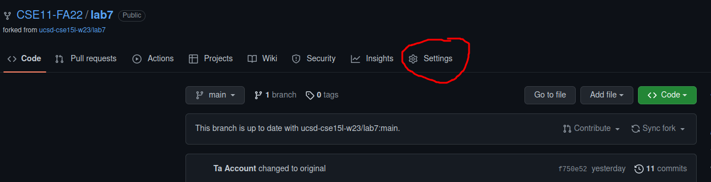

From there, scroll all the way down until you see the section labeled "danger zone"

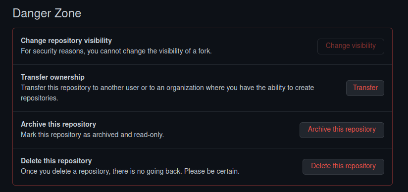

Click "Delete this repository" and type the prompted text to delete the repository.

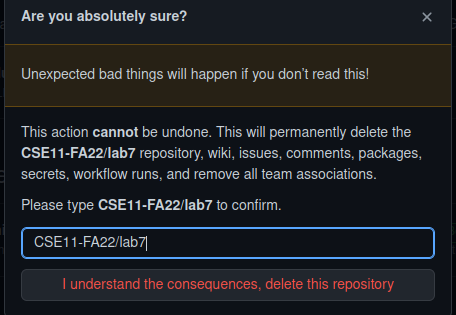

Now assuming the repository has been deleted successfully, remove the files and directories associated with the lab7 repository on whatever device you were working on.
use `rm -rf <directory>` to delete it.

## Step 2: Setup Fork the repository

Now that the fork and local files are deleted, we need to create a fresh fork repository.

Go to the following link: [Fork repo link](https://github.com/ucsd-cse15l-w23/lab7)

Click the fork button in the top right corner:

and create the fork by clicking the green button that is labeled "create fork".

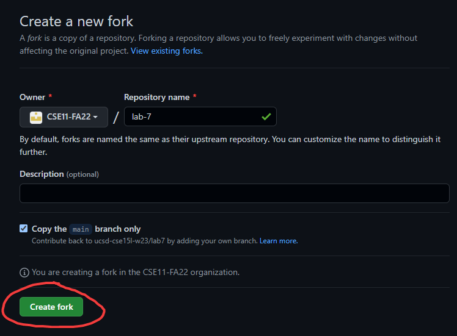

Once you are at your github repository page, click the green button that says "code"
and click the copy button to save the link to clone it in a later step.

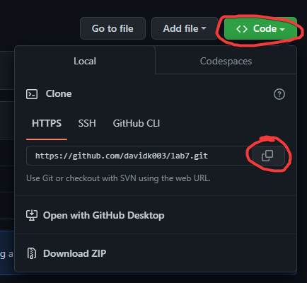

What should be copied is something like: `https://github.com/[username]/[repo-name].git`

## Step 3: The real deal Start the timer!
Pull up a timer on your phone or on another browser and hit start as soon as you move on to step 4.

# Actual competition (Step 4-9)

## Step 4: Log into ieng6

Open a terminal like bash and log into your desired account on the ieng6 server with the following command:

`ssh <user>@ieng6.ucsd.edu`

In my case it would be:

`ssh cs15lwi23avr@ieng6.ucsd.edu`

then press `<enter>` to run the command.

You should see a screen similar to this when you have logged in.:

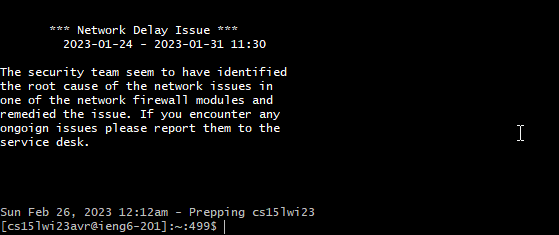

## Step 5: Clone your fork of the repository from your Github account

Now that we are logged into the ieng6 server, we can clone the repository onto the machine.

on the terminal type the following: `git clone ` followed by `<CTRL>+<V>` to paste the link that was copied previously.

Something similar to the following should be on the terminal `git clone https://github.com/davidk003/lab7` (the link will not be same)

To start cloning the fork, press `<enter>`, and repository will be downloaded with the following lines as output:

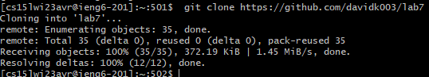

## An additional step that was helpful for me to get the push command working later on was to set the origin url of the to ssh by doing the following:

* Go back to your repistory's github website and click the green code button:

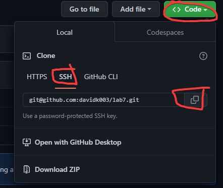

Then, click the ssh section and then the copy button.

With this link copied, we want to use the following command to ensure that our `push` command will correctly work.

`git remote set-url origin git@github.com:[git username]/[repository name].git`

Mine would be: `git remote set-url origin git@github.com:davidk003/lab7.git`

## Step 6: Run the tests, demonstrating that they fail

To run the tests, we need to set the working directory to the repository.
To do this, type `cd lab7` and `<enter>` to change directory into the lab7 folder.

Now to run the test, we need to type or copy the following command using `<CTRL>+<C>`:

`javac -cp .:lib/hamcrest-core-1.3.jar:lib/junit-4.13.2.jar *.java`

and press `<enter>` to compile the test.

Then once we have the test compiled, we can move on to run the test with the following command

Copy or type:
`java -cp .:lib/hamcrest-core-1.3.jar:lib/junit-4.13.2.jar org.junit.runner.JUnitCore ListExamplesTests` and `<enter>`

This should run the ListExamplesTest file and have the following output:

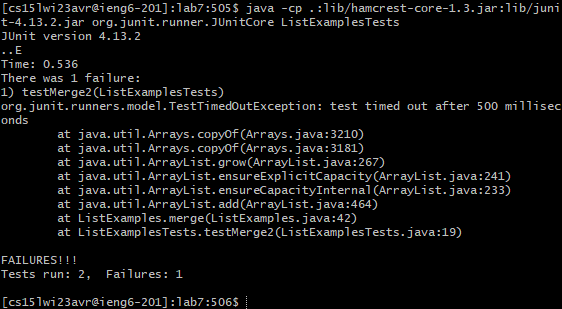

This shows that a test failed and either something should be fixed.

## Step 7: Edit the code file to fix the failing test

We can use a text editor like nano to edit the code file `ListExamples.java`.

To do this, from the current working directory, typing `nano ListExamples.java` and `<enter>` should show the text file opened in the editor.

Looking through the files, we can se that the error in the code is that `index1` is being incremented in the while loop for `list2` instead of `index2`.

To fix this, we need to change `index` to `index2`  on line 43.
* Press the `<down>` arrow key 43 times to get to line 43.
* Press the `<right>` arrow key 12 times to get to the right column.
* Press the `<backspace>` key to delete the 1, and type  `2` to replace the deleted 1.

Now that the file is fixed, we can save and close the file by pressing `<CTRL>+<X>` and type `y` and `<enter>` in response to the "Save modified buffer" prompt.

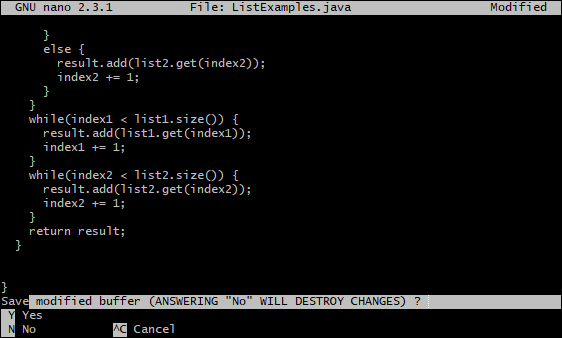

Then when asked for the file name to write, press `<enter>` to successfully save the files changes with the default name.

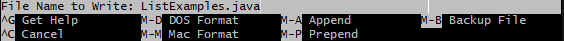

The file should be fixed and the tests should now pass successfully.

## Step 8: Run the tests, demonstrating that they now succeed

To save time typing/copying the command for running the tests, we can utilize the `<up>` key to access previously used commands.

To compile the tests again, press `<up> <up> <up>` (Total 3 times) and `<enter>` to use the command `javac -cp .:lib/hamcrest-core-1.3.jar:lib/junit-4.13.2.jar *.java` again.

To run the tests again, press press `<up> <up> <up>` (Total 3 times) and `<enter>` to run the tests with `java -cp .:lib/hamcrest-core-1.3.jar:lib/junit-4.13.2.jar org.junit.runner.JUnitCore ListExamplesTests`

You should see a message like this, showing that the tests passed successfully:

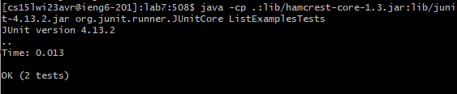

## Step 9: Commit and push the resulting change to your Github account (you can pick any commit message!)

Now that we have finished fixing the code, we can move onto making the updates availible to our repository.

* Type `git add ListExamples.java` and `<enter>` to add the file as a change.
* Type `git commit -m "[Your commit message here]"` to commit the change.

For example, I used `git commit -m "Fixed ListExamples to pass Junit test"`

*Type `git push` to finish off the and send the changes to your online github repository.

The output should be something like this after push:

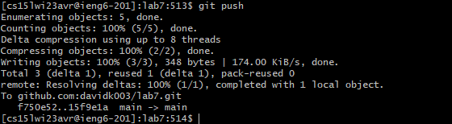

Stop your timer and congratulate yourself for finishing! Your changes should be availible online and this is the end of the list of steps.

# THE END

