# Lab report 5 - Going back
### *by David Kim*
## Context
As written on the coursepage on [Week 9](https://ucsd-cse15l-w23.github.io/week/week9/):

Go back and pick a favorite lab report or a lab activity you really liked or did not finish. Write a post going into detail on how you did the task, doing the task in a different way, or applying something you learned later to the same task.

I decided to choose and work on the string server, lab report 2, from [Week 3](https://ucsd-cse15l-w23.github.io/week/week3/).
I chose this specific assignment because I had no idea how websites worked internally before this, and doing this lab helped me to understand the basics of how a program running on a server might be accessed on a network/internet.

I am hoping to improve and add even further to the string server, as I found this to be the most fun lab report.

The goal of lab report 2 was the following:

Part 1: Write a StringServer so that strings added to it are recorded.

Part 2: Choose a bug from week 3's lab and provide:

* A failure-inducing input
* An input that doesn’t induce a failure
* The symptom
* The bug, as the before-and-after code change required to fix it

Part 3:

In a couple of sentences, describe something you learned from lab in week 2 or 3 that you didn’t know before.

## Part 1: StringServer
For lab report 5, I added extra parts to the string server. On top of supporting functionality to add strings to the server, I also supported removing strings and logging requests to the server.

Code from StringServer.java
``` java
import java.io.IOException;
import java.net.URI;
import java.util.ArrayList;
import java.util.Date;
class Handler implements URLHandler {
    public record ServerRequest(Date reqDate, String reqType, String message){}

    ArrayList<String> stringList = new ArrayList<>();
    ArrayList<ServerRequest> requestLog = new ArrayList<>();
    String outputString = "";


    public String handleRequest(URI url) {
        if (url.getPath().equals("/")) {
            outputString = "STRING SERVER CONTENTS:\n"; //Reset string
            for (String s : stringList) {
                outputString = outputString + s + "\n";
            }
            return outputString;
        }
        else
        {
            System.out.println("Path: " + url.getPath());
            if (url.getPath().contains("/add-message"))
            {
                String[] parameters = url.getQuery().split("=");
                if (parameters[0].equals("s"))
                {
                    stringList.add(parameters[1]);
                    requestLog.add(new ServerRequest(new Date(System.currentTimeMillis()), "/add-message", parameters[1]));
                    return "Added [" + parameters[1] + "] to the stringserver.\n";
                }
            }
            else if(url.getPath().contains("/remove-message"))
            {
                String[] parameters = url.getQuery().split("=");
                if (parameters[0].equals("s"))
                {
                    if(stringList.contains(parameters[1]))
                    {
                        int count = 0;
                        while(stringList.contains(parameters[1]))
                        {
                            stringList.remove(parameters[1]);
                            count++;
                        }
                        requestLog.add(new ServerRequest(new Date(System.currentTimeMillis()),"/remove-message", parameters[1]));
                        return "Removed " + count + " instances of [" + parameters[1] + "] from the stringserver.\n";
                    }
                    else
                    {
                        requestLog.add(new ServerRequest(new Date(System.currentTimeMillis()),"/remove-message[FAILED]", parameters[1]));
                        return "Failed removing [" + parameters[1] + "], does not exist in stringserver.\n";
                    }
                }
            }
            else if(url.getPath().contains("/request-logs"))
            {
                outputString = "LOG START\n";
                for (ServerRequest serverRequest : requestLog) {
                    outputString = outputString + serverRequest.reqDate() + "| Request: " + serverRequest.reqType() + " " + serverRequest.message() + "\n";
                }
                outputString += "LOG END.\n";
                return outputString;
            }
            return "404 Not Found!";
        }
    }
}

class StringServer {
    public static void main(String[] args) throws IOException {
        if(args.length == 0){
            System.out.println("Missing port number! Try any number between 1024 to 49151");
            return;
        }

        int port = Integer.parseInt(args[0]);
        Server.start(port, new Handler());
    }
}
```

Implementation details:

I used an `ArrayList` of strings to contain the strings that will be recorded by the server. Another `ArrayList` was used to contain a record structure that I named `ServerRequest`. `ServerRequest` contains the time the request was made, the type of request and parameter used in the request.

### Details and Testing `/add-message?s=<string>`

### Details
For the details of each server command, because I already explained the conditionals for pathfinding in lab report 2, I will detail the new additions for the code.

What methods are called?
* 2 `add()` calls
* `currentTimeMillis()`
1 call, `stringList.add();` is used to add a string to server, the 2nd call, `requestLog.add()`, is used to log a command request. `currentTimeMillis()` gets the current milliseconds from unix time to be used to log a server request.

Relevant arguments?
* `parameters[1]` is passed to add to `stringList`, an ArrayList that contains all the strings in the stringserver.
* `new ServerRequest(new Date(System.currentTimeMillis()), "/add-message", parameters[1])` is a parameter to `add()` to `requestLog` which is an ArrayList of records. A new record is created and added in the parameter with the current time, the `/add-message` command type, and the string used with the command, `parameters[1]`.

Relevant class fields that changed?

The `stringList` and `requestLog` ArrayLists should have changed to add the new string as well as a log for the request, with its time, request type and string added.


### Testing
Initial root contents:

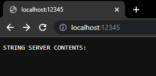

Adding `test1` to the StringServer:

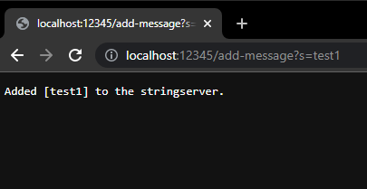

Root after adding `test1`:

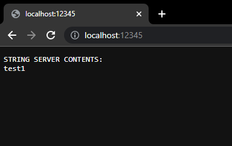

Adding `test1` to `test10` and one more `test1` to the StringServer:

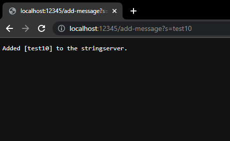

Root after adding all those strings:

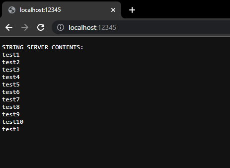

### Details and Testing `/remove-message?s=<string>`

### Details

What methods are called?
* 2 calls to `contains()`
* `remove()`
* `currentTimeMillis()`
* `add()`

2 calls to `contains()` are used to loop and check and to continually remove all instances of a string from the string server. `remove()` is used to the string from `stringList`, which contains the strings in the server. `currentTimeMillis()` is used again to record the time for request logging, and `add()` is called to add to the ArrayList recording server requests.

Relevant arguments?
* `parameters[1]` is passed to check the `stringList` with `contains()` to eventually used as a parameter in `remove()` if the string is found.
* `new ServerRequest(new Date(System.currentTimeMillis()), "/remove-message", parameters[1])` is a parameter to `add()` to `requestLog` which is an ArrayList of records. A new record is created and added in the parameter with the current time, the `/remove-message` command type, and the string used with the command, `parameters[1]`.

Relevant class fields that changed?

The `stringList` and `requestLog` ArrayLists should have changed to remove the new string as well as a log for the request, with its time, request type and string removed, or if the removal failed.

### Testing

Assume that the strings in the server carried over from the last section for `/add-message`

Removing `test1` from the StringServer:

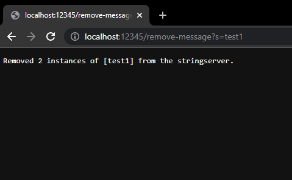

Root after removing `test1`:

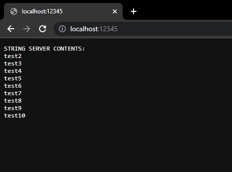

Removing `test5` from the StringServer:

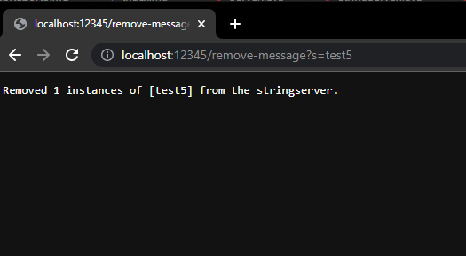

Root after removing `test5`:

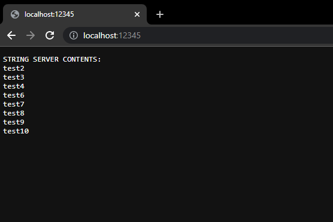

### Details and Testing `/request-logs`

### Details

What methods are called?
* `reqDate()`
* `reqType()`
* `message()`

All three of these calls are used to build an output out of the `ServerRequest` ArrayList with a loop that adds the information in a `ServerRequest` and ends with a `\n` newline to add another request on a new line.

Relevant class fields that changed?

None of the arraylists in the class should have changed, only the `outputString` with each request log as a string should be changed and returned.

### Testing

After all the commands from the previous section my command's output looks like the following.

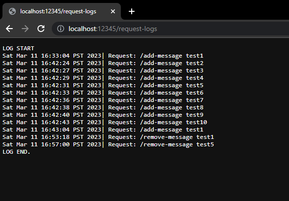

The date, request and string requested is a part of a singular request log.

## Part 2: Debugging

For lab report 5, I decided to debug and fix the 2 remaining methods in the `ArrayExamples.java` file that I did not debug from lab report 2. `reverseInPlace()`  and `reversed()` 

### `reverseInPlace()` 

Failure inducing input:

* The array `[1, 2, 3]` should be reversed to `[3, 2, 1]` but the method `reverseInPlace()` fails to do so.

``` java
@Test 
public void testReverseInPlace2() {
int[] input1 = { 1,2,3 };
ArrayExamples.reverseInPlace(input1);
assertArrayEquals(new int[]{ 3,2,1 }, input1);
}
```

Non-failure inducing input:

* The array `[3]` should be reversed to `[3]` and the method `reverseInPlace()` succeeds.

``` java
@Test 
public void testReverseInPlace() {
int[] input1 = { 3 };
ArrayExamples.reverseInPlace(input1);
assertArrayEquals(new int[]{ 3 }, input1);
}
```

Symptom of running the tests:

Failure symptom:

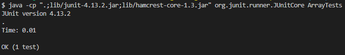

Non-failure symptom:

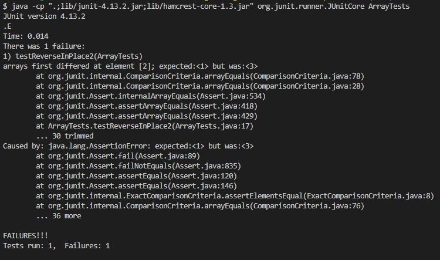

The bug fix:

BEFORE
``` java
static void reverseInPlace(int[] arr) {
    for(int i = 0; i < arr.length; i += 1) {
      arr[i] = arr[arr.length - i - 1];
    }
  }
```
AFTER
```java
static void reverseInPlaceFixed(int[] arr) {
    for(int i = 0; i < arr.length/2; i += 1) {
    int temp = arr[i];
    arr[i] = arr[arr.length - i - 1];
    arr[arr.length - i - 1] = temp;
    }
}
```

To fix reverseInPlace(), I used a temporary variable used to swap the indexes of the array. I also changed the bounds of the loop to be half the size of the array to "mirror" each half of the array and if there is a middle element, it would remain unswapped.

### `reversed()`

Failure inducing input:

* The array `[1, 2, 3]` should be reversed to `[3, 2, 1]` but the method `reversed()` fails to do so.

``` java
  @Test
  public void testReversed2() {
    int[] input1 = {1,2,3};
    assertArrayEquals(new int[]{3,2,1}, ArrayExamples.reversed(input1));
  }
```

Non-failure inducing input:

* Reversing an empty array does nothing and therefore the method `reversed()` succeeds.

``` java
  @Test
  public void testReversed() {
    int[] input1 = { };
    assertArrayEquals(new int[]{ }, ArrayExamples.reversed(input1));
  }
```


Symptom of running the tests:

Failure symptom:

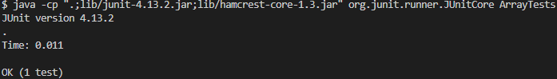

Non-failure symptom:

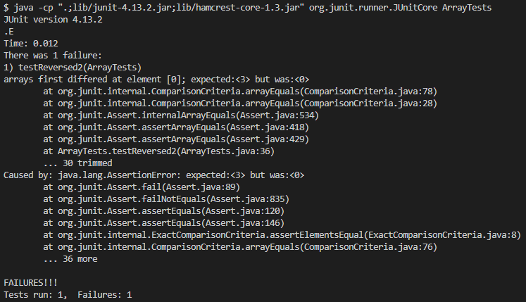

The bug fix:

BEFORE
``` java
static int[] reversed(int[] arr) {
    int[] newArray = new int[arr.length];
    for(int i = 0; i < arr.length; i += 1) {
      arr[i] = newArray[arr.length - i - 1];
    }
    return arr;
  }

```
AFTER
```java
  static int[] reversedFixed(int[] arr) {
    int[] newArray = new int[arr.length];
    for(int i = 0; i < arr.length; i += 1) {
      newArray[i] = arr[arr.length - i - 1];
    }
    return newArray;
  }
```

The fix i made for this `reversed()` method was very simple. I noticed that the array assignments were flipped, instead of `newArray[i] = arr[arr.length - i - 1];`, the original method had `arr[i] = newArray[arr.length - i - 1];` which meant that it was assigning values to the old array and overwriting itself. The method should also return the `newArray` instead of `arr` which is the old array.

## Part 3: Reflection

I indirectly learned how to use java's built-in Date functionality and how to use the java Record class as a result of implementing the logging functionality. On top of that, I was reminded again on how webservers' path structure and request handling worked through this lab report.